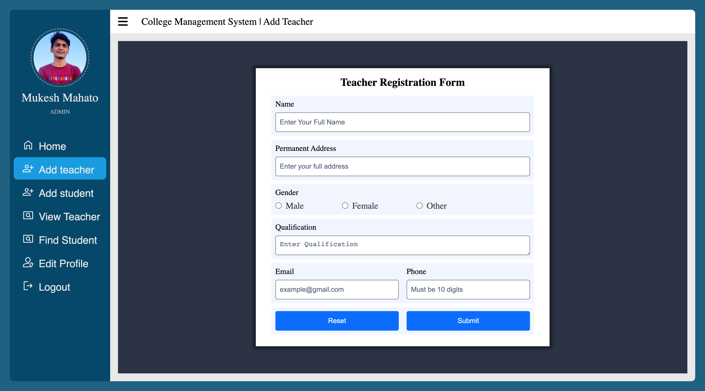
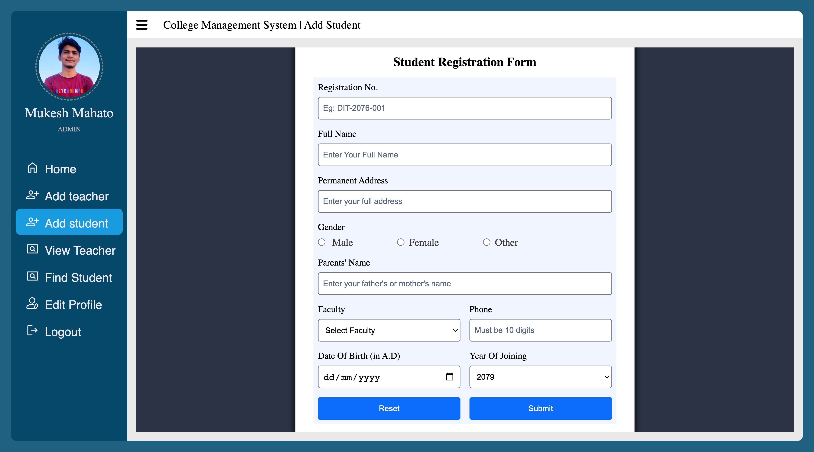
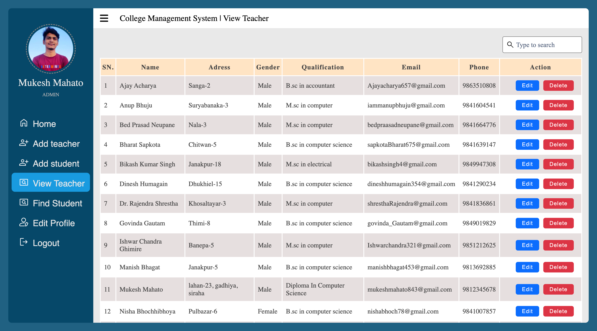
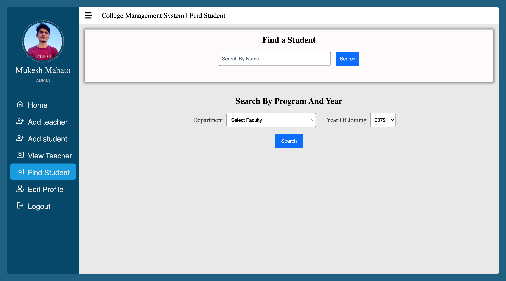
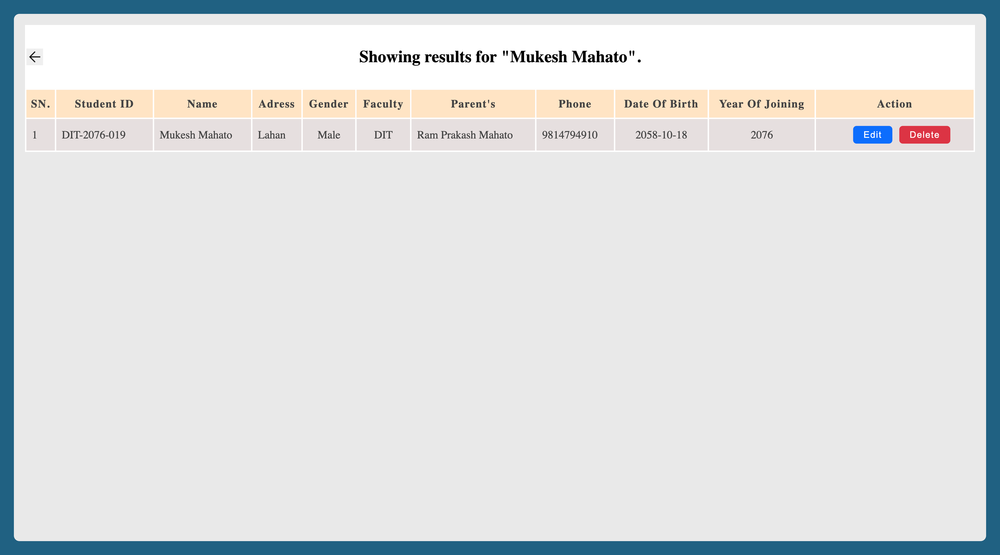
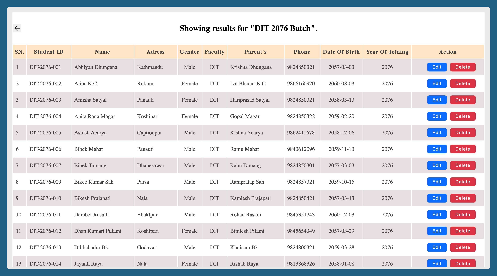
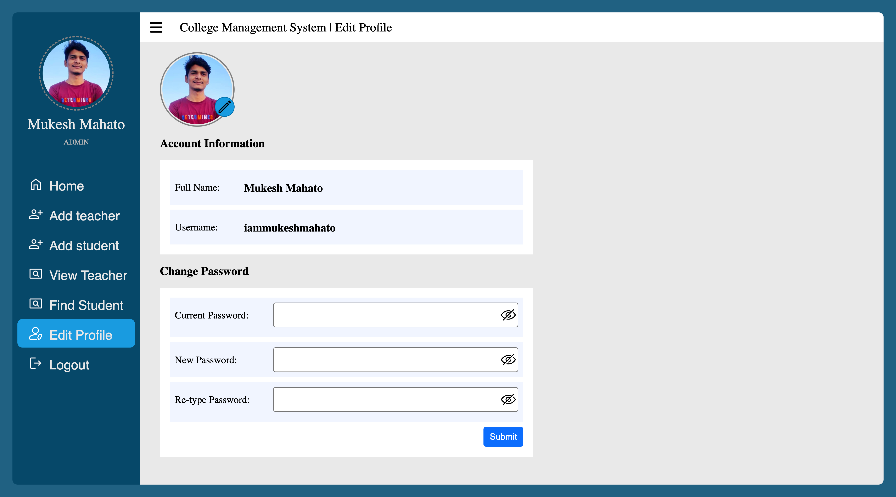

# College Management System V1

## Table of Contents

-  [Introduction](#introduction)
-  [Features](#features)
-  [Technologies](#technologies)
-  [Installation](#installation)
-  [Usage](#usage)
-  [Screenshorts](#screenshorts)
-  [Contributing](#contributing)
-  [Author](#author)

## Introduction

This is a simple college management system. It is a web based application that allows college admin to manage students' & teachers' record efficiently.

## Features

-  Admin can login
-  Admin can add student's record
-  Admin can view student by batch or by name or by Student ID
-  Admin can add teacher's record
-  Admin can view teachers
-  Admin can update profile image and password

## Technologies

-  HTML
-  CSS
-  JavaScript
-  PHP
-  MySQL

## Installation

-  Clone the repository in `../XAMPP/xamppfiles/htdocs/` path
-  Open Xampp and run `Apache Web Server` & `MySQL Database`
-  Goto `phpmyadmin` and create a database named `MyCollege`
-  Import the `MyCollege.sql` file into the database which is located inside `sql` folder
-  Run the application by hitting http://localhost/college-management-system-v1

## Usage

-  Open the application in your browser
-  Enter Username: `iammukeshmahato` & Password: `hidden`
-  After login you will see Admin Dashboard
-  Go to `/php/add-student.php` to add student
-  Go to `/php/view-student.php` to view student record
-  Go to `php/add-teacher.php` to add teacher
-  Go to `php/view-teacher.php` to view teacher
-  Go to `php/setting.php.php` to update profile information

## Screenshorts

### Login Page

### Home Page

### Add Teacher Page

### Add Student Page

### View Teacher Page

### Find Student Page

### View Student By Name

### View Student By Batch

### Setting Page

## Contributing

-  Fork the repo `college-management-system-v1`
-  Commit your changes
-  Create pull request mentioning comment regarding your changes

## Author

-  [Mukesh Mahato](https://github.com/iammukeshmahato)
